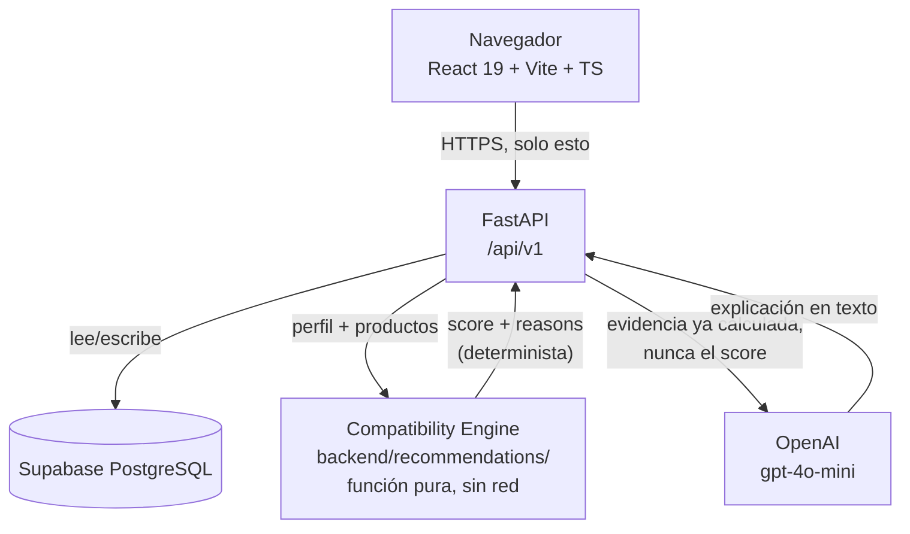

# Arquitectura — ADAPTA

## Diagrama



El navegador solo habla HTTPS con FastAPI. Nunca con Supabase, nunca con
OpenAI directamente — eso es lo que impide que `SUPABASE_ANON_KEY` real de
escritura o `OPENAI_API_KEY` terminen en el bundle público.

## Componentes

| Componente | Dónde vive | Qué hace |
|---|---|---|
| Frontend | `frontend/src/` | React 19 + Vite + TypeScript + Tailwind 4. Consume la API, nunca la base ni OpenAI directo. |
| API | `backend/main.py` + `backend/routers/` | FastAPI bajo `/api/v1`. Única capa que toca Supabase y OpenAI. |
| Cliente de Supabase | `backend/services/supabase.py` | Único punto que abre el cliente. Los routers lo piden con `Depends(get_supabase)`. |
| Motor de compatibilidad | `backend/recommendations/engine.py` | Función pura de Python. Sin red, sin `random`, sin `datetime.now()` en el cálculo del score. Se puede probar sola. |
| Explicación en lenguaje natural | `backend/recommendations/explanation.py` | Recibe `score` y `reasons` ya calculados. Con `OPENAI_API_KEY` intenta redactarlos con OpenAI; sin clave, o si la llamada falla, cae a una plantilla determinista. |
| Chat | `backend/routers/chat.py` | Igual criterio: intenta OpenAI con el catálogo como contexto; si falla, cae a respuestas por palabra clave sobre el catálogo real. |
| Base de datos | Supabase PostgreSQL | `supabase/schema.sql` (estructura), `supabase/seed.sql` (datos de demo), `supabase/policies.sql` (permisos de lectura/escritura por RLS). |

## Flujo de datos de una recomendación

```
perfil (FitProfile) → POST /api/v1/recommendations
    → se leen products + product_adaptation_needs + providers de Supabase
    → se arma ProfileInput y ProductInput[] (backend/recommendations/models.py)
    → score_products() del motor calcula el score, determinista
    → se ensambla Recommendation con el product y el provider incrustados
    → explain() intenta OpenAI con la evidencia ya calculada; si falla,
      cae a la plantilla — nunca cambia el score
    → build_adaptations() arma las sugerencias para lo que quedó en "gap"
    → respuesta ordenada por score descendente, decidida por el servidor
```

## Límites de responsabilidad

El compatibility score lo calcula siempre el backend con lógica
determinista (`backend/recommendations/engine.py`); el frontend solo lo
muestra, nunca lo recalcula. OpenAI interpreta, estructura y explica; nunca
puntúa — `explain()` recibe el score ya hecho y no puede tocarlo. El
navegador no habla con Supabase ni con OpenAI directamente, solo con
FastAPI. El orden del directorio de negocios (`featured` → `verified` →
`free`) lo decide el backend en `routers/providers.py`, porque es
literalmente lo que el negocio compra al inscribirse, y dejarlo en el
frontend significaría que cualquiera lo cambia desde la consola del
navegador.

## Decisiones tomadas y por qué

`product_adaptation_needs` es una tabla aparte y no un array dentro de
`products`, porque el motor filtra y cuenta por necesidad, y eso es mucho
más barato con un índice (`product_needs_need_idx`) que recorriendo
arrays. `products.provider_id` tiene `ON DELETE RESTRICT` porque un
producto sin proveedor rompe el bloque "dónde conseguirlo", que es el
final del recorrido de la persona usuaria — de hecho, `routers/recommendations.py`
descarta explícitamente cualquier producto cuyo proveedor no exista.

Los schemas heredan de `CamelModel` (`backend/schemas/provider.py`) para
que el JSON viaje en camelCase, como espera el frontend, sin que cada campo
de Python tenga que escribirse dos veces.

Row Level Security está activo en las cinco tablas. `providers`,
`products` y `product_adaptation_needs` tienen lectura pública: el
catálogo es la razón de ser del producto, nadie necesita cuenta para
buscar ropa adaptada. `provider_applications` y `adaptation_requests`
solo aceptan **insertar**, nunca leer, editar ni borrar: cualquiera puede
mandar una solicitud sin login, pero nadie puede ver las de otra persona.

Si OpenAI o Supabase no responden, el backend degrada en vez de romper:
sin Supabase configurado, cualquier endpoint que la necesite devuelve 503
(`services/supabase.py`); sin `explanation` de OpenAI, la recomendación se
devuelve completa igual, sin ese campo; y `POST /providers/applications`
está limitado a 5 peticiones por minuto por IP (`backend/rate_limit.py`),
porque es público y no tiene autenticación.

## Cuándo se actualiza este documento

Cada vez que cambie un contrato de `docs/api-contract.md`, una
responsabilidad descrita acá, o algo de la infraestructura — por ejemplo,
si se agrega un servicio nuevo o cambia el proveedor de hosting.
